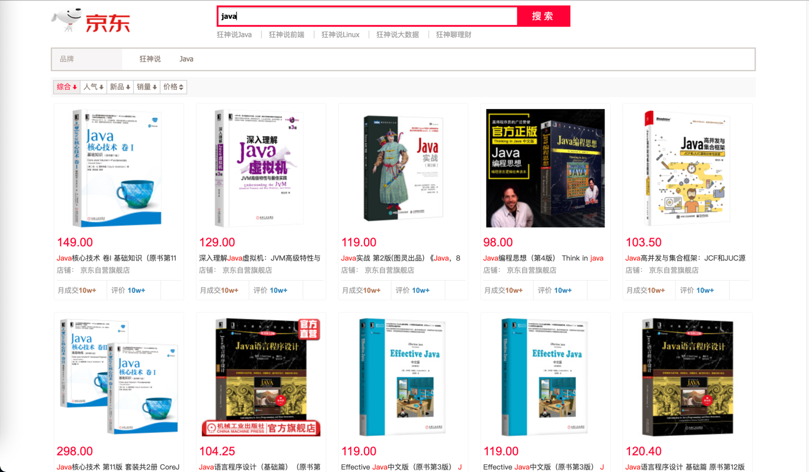

# ElasticSearch-JD

#### 介绍
使用ElasticSearch做一个简单的京东商城搜索页面

#### 软件架构
前端：Vue  
后端：SpringBoot  
中间件：ElasticSearch  

#### 安装教程
1. 在本地启动ES，端口9200
2. git clone https://gitee.com/AngRe/elastic-search-jd.git
3. 加载maven
4. 启动项目
5. 访问 http://localhost:8080

#### 使用说明
1. 在搜索框中输入关键字，页面展现相关商品

2. 页面展示的数据都是从京东网站上实时爬取的